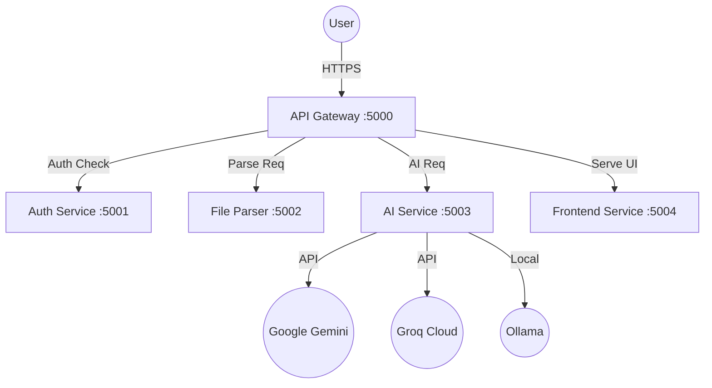

# AceNow Architecture & Tech Stack

This document details the internal design and technical decisions of the AceNow microservices ecosystem.

## 📡 Service Flow

## 🛠️ Technology Stack

| Layer | Technology |
| :--- | :--- |
| **Framework** | Python / Flask |
| **Authentication** | Google Identity Services (OAuth 2.0) |
| **AI Processing** | Google GenAI, Groq (Llama 3.3), Ollama |
| **File Parsing** | `pdfplumber`, `python-pptx`, `PyPDF2` |
| **Frontend** | Vanilla JS (ES6+), CSS3 (Glassmorphism), HTML5 |
| **Parallel Downloads** | `JSZip` (Client-side bundling) |
| **Containerization** | Docker, Docker Compose |

## 🧠 Specialized Logic

### 1. AI Fallback Engine
The AI Service implements a robust retry-strategy:
- **Priority 1**: Gemini 2.0 Flash (Fast & Accurate).
- **Priority 2**: Groq (Llama 3.3 70B) - if Gemini hits quota/rate limits.
- **Priority 3**: Ollama (Llama 3.2) - if running locally.
- **Parsing**: Advanced JSON-repair logic handles varied AI output formats to ensure UI stability.

### 2. File Processing
- **Scanning**: Multi-threaded metadata fetching from Google Classroom.
- **Parsing**: Server-side text extraction to keep the frontend light.
- **Bundling**: Client-side ZIP generation avoids heavy server-side temporary file storage.

### 3. API Gateway Routing
The Gateway handles CORS and acts as a security buffer:
- `/auth/*` -> Auth Service
- `/parse/*` -> File Parser
- `/ai/*` -> AI Service
- `/*` (Static) -> Frontend Service

## 📦 Deployment Configuration

- **`Dockerfile`**: A multi-stage setup that installs all dependencies and prepares the environment.
- **`start.sh`**: A supervisor script that boots all microservices concurrently within a single container (optimized for free hosting like HF Spaces).
- **`run_dev.py`**: A developer-friendly Python script for parallel local execution with live logs.

## 🔒 Security
- **No API Keys in Frontend**: All sensitive keys are stored in the backend `.env`.
- **Stateless Auth**: Uses Google JWT verification.
- **Proxy Aware**: Optimized for Windows and Unix environments with `NO_PROXY` configurations.
