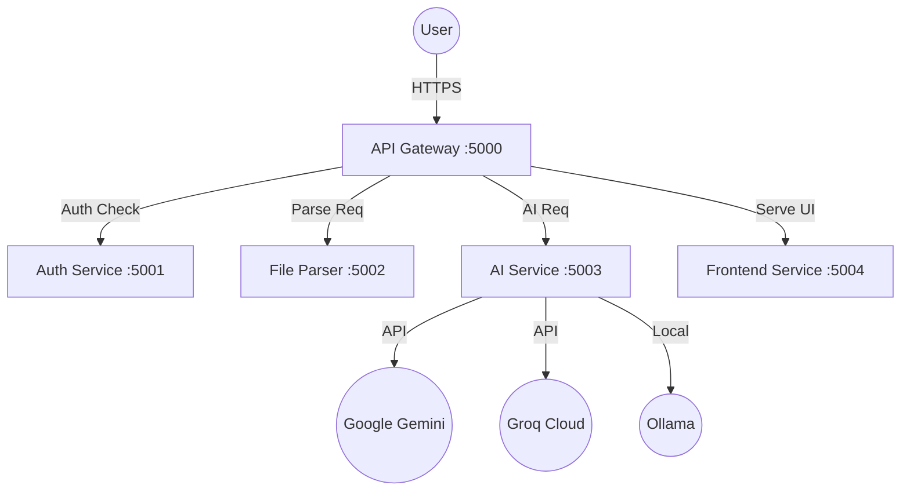

# AceNow v2.0 Architecture & Tech Stack

This document details the internal design and technical decisions of the AceNow microservices ecosystem, updated for the Version 2.0 release.

## 📡 Service Flow

```mermaid
graph TD
    User((User)) -->|HTTPS| Gateway[API Gateway :5000]
    Gateway -->|Auth Check| Auth[Auth Service :5001]
    Gateway -->|Parse Req| Parser[File Parser :5002]
    Gateway -->|AI Req| AIService[AI Service :5003]
    Gateway -->|Serve UI| Frontend[Frontend Service :5004]
    
    AIService -->|API| Gemini((Google Gemini))
    AIService -->|API| Groq((Groq Cloud))
    AIService -->|Local| Ollama((Ollama))
```

## 🛠️ Technology Stack

| Layer | Technology |
| :--- | :--- |
| **Framework** | Python / Flask |
| **Authentication** | Google Identity Services (OAuth 2.0) |
| **AI Processing** | Google GenAI (2.0 Flash), Groq (Llama 3.3), Ollama |
| **File Parsing** | `pdfplumber`, `python-pptx`, `PyPDF2` |
| **Frontend** | Vanilla JS (ES6+), CSS3 (Glassmorphism), HTML5 |
| **Parallel Downloads** | `JSZip` (Client-side bundling) |
| **Containerization** | Docker, Docker Compose |

## 🧠 Version 2.0 Specialized Logic

### 1. Adaptive Quiz Engine
The quiz system now incorporates **Adaptive Learning**:
- **Error Tracking**: Incorrect answers are tracked during a session.
- **Context Re-injection**: When a new quiz is generated, previous struggles are appended to the AI prompt to focus on weak areas.
- **Rationale Analysis**: AI provides detailed pedagogical feedback for every choice, not just the correct one.

### 2. Context-Aware Assistant
The AI Assistant maintains a conversational history and shared context:
- **Shared Memory**: The assistant knows which course you are currently viewing.
- **Cross-Service Query**: It can trigger summarization or key topic identification on the fly.

### 3. Flexible Material Handling
- **Manual Upload**: Users can upload `.pdf` and `.pptx` files directly to the File Parser service.
- **Unified Cache**: Both Classroom and manual files are normalized into a single text stream for AI processing.

### 4. API Gateway Routing
The Gateway handles CORS and acts as a security buffer:
- `/auth/*` -> Auth Service
- `/parse/*` -> File Parser
- `/ai/*` -> AI Service
- `/api/config` -> Gateway (Environment injection)
- `/*` (Static) -> Frontend Service

## 📦 Deployment Configuration

- **`Dockerfile`**: A multi-stage setup that installs all dependencies and prepares the environment.
- **`start.sh`**: A supervisor script that boots all microservices concurrently within a single container (optimized for Hugging Face Spaces).
- **`run_dev.py`**: A developer-friendly Python script for parallel local execution with live logs.

## 🔒 Security
- **No API Keys in Frontend**: All sensitive keys are stored in the backend `.env`.
- **Stateless Auth**: Uses Google JWT verification.
- **Automation**: CI/CD pipeline via GitHub Actions handles binary-free cleanup for secure deployment.
